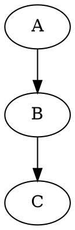

# Pandoc Diagram Filter Example

Here is a graphviz diagram:



And here is a plantuml diagram:

```uml
@startuml
Alice -> Bob: Authentication Request
Bob --> Alice: Authentication Response
@enduml
```
